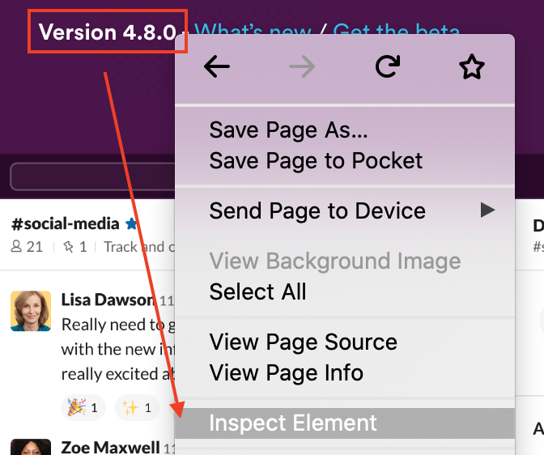
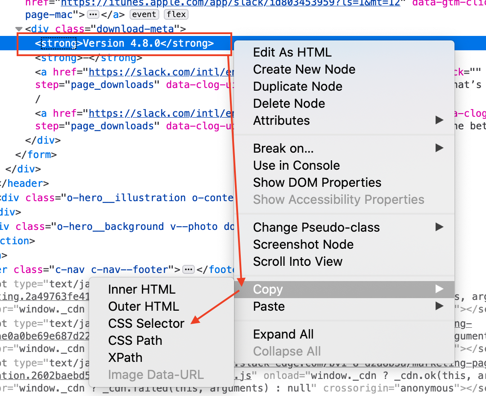

# VersionsMonitor

**Monitoring interface for the latest versions of any software or applications**

***

[](https://reactjs.org/)
[](https://webpack.js.org/)
[](https://developer.mozilla.org/en-US/docs/Web/JavaScript)
[](https://nodejs.org)
[](http://perso.crans.org/besson/LICENSE.html)

## Required

- This project requires a version of NodeJS >= 12.18.3 (not tested with earlier versions).
- The application stores the data in the browser so it is necessary that your browser has the `localStorage` property (on the latest versions of most browsers it is present), you can still check if your version is compatible [here](https://developer.mozilla.org/fr/docs/Web/API/Window/localStorage). In case you don't have it, don't worry, you can always save the configuration on the server or on your machine.

## Build

This project is divided into two parts, a client part and a server part. You must first build the client part before you can start the server. Here is the list of commands to be executed (you can also run the script `auto-install.js` which contains the same commands) :

Install dependencies:

```shell
npm install
```

Build production app:

```shell
npm run build-prod
```

Results of build are in `server/public`

## Development

Run client and server tools development (one server for client part and an other for the server part):

```shell
npm run dev
```

There are other scripts in the `package.json` file to help you with development. They are explicit enough for you to understand them.

## Run

Once the build (dev or prod) is done you just have to launch the server, for that you just have to type the following commands:

```shell
npm run start OR npm start
```

## How It Works

To retrieve the version of an application or software, the application needs 2 properties:

- **URL**: that will allow to retrieve the HTML code where the version is located
- **Selector**: the CSS selector that points to the element that contains the version.

With these parameters a request is sent to the server. The server is in charge of fetching the HTML code of the page. Then using the CSS selector it retrieves the element that contains the version. Then if a Regex is passed, the result is refined (only takes into consideration the first parenthesis block). Once the processing is finished the application receives the response from the server containing the version number.
You will have noticed that there is an advanced button that allows you to put particular headers, it is especially useful when the page you want to retrieve is generated depending on the OS with which the user accesses it.<br/>
When the application detects a new version you will see a popup appear to let you know.

## How To Use It

- Open create menu with the "+";
- Give a name;
- Copy the URL of the page on which the version number is located;
- Copy CSS Selector. To do this, on Firefox, you have to right click -> 'inspect element' on the version number. Right click on the tag in the development tool, drag the mouse on 'Copy' and click on 'CSS Selector'. On Chrome: 'inspect', 'Copy' -> 'Copy selector'; <br/>
 
- Can add a regex. This on is very usefull: `([\d\.]+)` (keep only numbers and .)
- Can add your version number 
- Can set URL to the application's logo
- Click on 'ADVANCED' to be able to put custom headers
